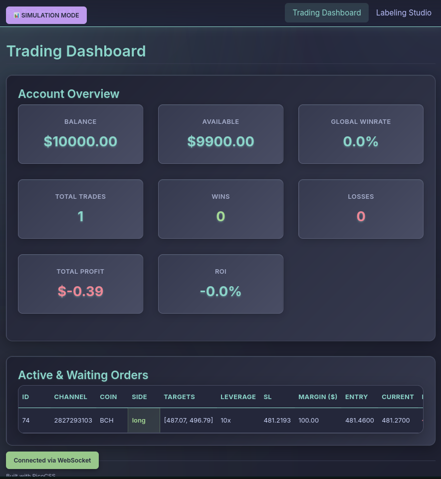
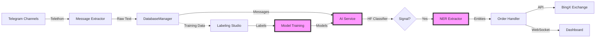
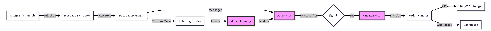
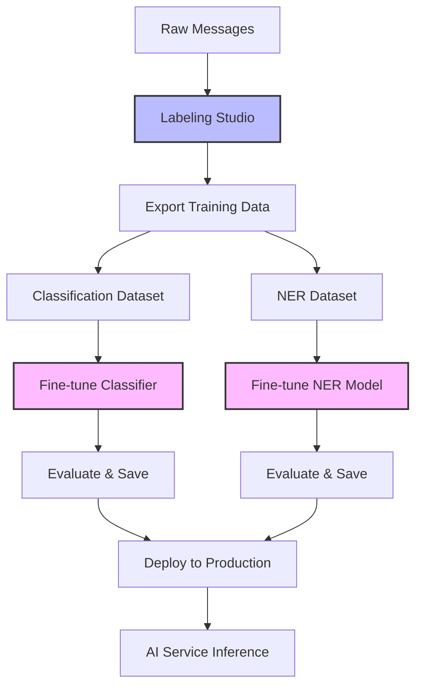
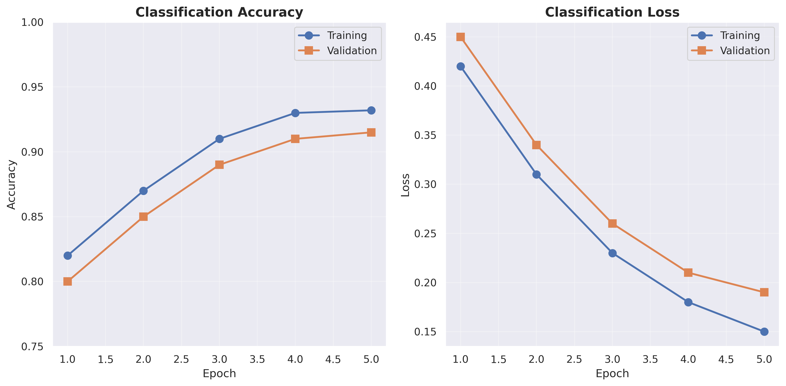

<div align="center">

# 🤖 BingXtg: AI-Powered Trading Signal Parser

### Intelligent Telegram Signal Processing with Deep Learning

[](https://www.python.org/downloads/)
[](https://www.djangoproject.com/)
[](https://huggingface.co/)
[](LICENSE.md)
[](https://github.com/psf/black)

[Features](#-key-features) • [Architecture](#-architecture) • [Tech Stack](#-technology-stack) • [Quick Start](#-quick-start) • [ML Pipeline](#-ml--ai-pipeline) • [Documentation](docs/)

---


*Real-time trading dashboard with WebSocket updates*

</div>

## 📋 Overview

**BingXtg** is a production-grade, ML-powered trading automation platform that intelligently parses cryptocurrency trading signals from Telegram channels and executes trades on the BingX exchange. Built with modern deep learning techniques, it demonstrates end-to-end machine learning engineering—from data ingestion and labeling to model training, deployment, and real-time inference.

### 🎯 Problem Statement

Cryptocurrency traders often receive signals from multiple Telegram channels with inconsistent formats. Manual parsing is error-prone and time-consuming. This project solves that by:
- **Automating signal extraction** using fine-tuned transformer models
- **Classifying signal quality** with multi-class text classification
- **Extracting trading parameters** via Named Entity Recognition (NER)
- **Managing risk** through adaptive position sizing and win-rate tracking

## ✨ Key Features

<table>
<tr>
<td width="50%">

### 🧠 ML/AI Components
- **🤗 HuggingFace Transformers**: Fine-tuned XLM-RoBERTa for signal classification
- **📊 Token Classification**: Custom NER models for entity extraction
- **🎓 Active Learning**: Browser-based labeling studio with AI suggestions
- **📈 Model Training Pipeline**: End-to-end training scripts with validation
- **🔄 Auto-Labeling**: Batch annotation with confidence thresholding

</td>
<td width="50%">

### ⚙️ Engineering Excellence
- **⚡ Async Architecture**: Telethon + Django Channels for real-time processing
- **🔌 WebSocket Updates**: Live dashboard with sub-second latency
- **💾 Robust Data Pipeline**: SQLite with WAL mode, foreign keys, migrations
- **🐳 Containerized**: Docker support with volume persistence
- **📊 Performance Monitoring**: Per-channel win rate tracking and analytics

</td>
</tr>
</table>

---

## 🏗️ Architecture

<div align="center">



</div>

### Data Flow
1. **Ingestion**: Async Telegram clients capture messages → `DatabaseManager` (SQLite with WAL)
2. **AI Processing**: `ai_service.py` loads HF models → Classification + NER extraction
3. **Trading Logic**: `order_handler.py` validates signals → Calculates position size → Places orders
4. **Real-time Updates**: Django Channels broadcasts to dashboard group via WebSockets
5. **Feedback Loop**: Labeled data → Model retraining → Deployment



---

## 💻 Technology Stack

<div align="center">

### Core ML/AI
[](https://python.org)
[](https://huggingface.co)
[](https://pytorch.org)
[](https://spacy.io)

### Backend & Data
[](https://djangoproject.com)
[](https://channels.readthedocs.io)
[](https://sqlite.org)
[](https://redis.io)

### Tools & DevOps
[](https://docker.com)
[](https://github.com/astral-sh/uv)
[](https://github.com/Delgan/loguru)

</div>

### Key Libraries
| Category | Technologies |
|----------|-------------|
| **ML/AI** | HuggingFace Transformers, PyTorch, spaCy, XLM-RoBERTa |
| **Web Framework** | Django 5.0+, Django Channels, WebSockets |
| **Async I/O** | Telethon (Telegram), asyncio, ASGI |
| **Data** | SQLite (WAL mode), Pandas, Datasets |
| **API Integration** | BingX REST API, aiohttp |
| **Monitoring** | Loguru, Django Admin, Custom Dashboard |

---

## ⚠️ Disclaimer

> **Risk Warning**: Cryptocurrency trading involves substantial risk of loss. This software is provided for educational purposes. The authors assume no responsibility for financial losses. Always test in simulation mode and understand the code before deploying with real funds.

---

## � Quick Start

### Prerequisites

```bash
# System Requirements
Python 3.11+
Git
Redis (optional, for production)
Docker (optional)
```

### Installation

<details>
<summary><b>� Standard Installation</b></summary>

```bash
# 1. Clone the repository
git clone https://github.com/Vartius/BingXtg.git
cd BingXtg

# 2. Install dependencies with uv (recommended)
pip install uv
uv sync

# 3. Configure environment
cp .env.example .env
# Edit .env with your credentials:
# - TELEGRAM_API_ID, TELEGRAM_API_HASH
# - BINGX_API_KEY, BINGX_SECRET_KEY
# - Trading parameters (LEVERAGE, TP, SL)

# 4. Run database migrations
uv run manage.py migrate

# 5. Create superuser (optional, for admin panel)
uv run manage.py createsuperuser

# 6. Start the development server
uv run manage.py runserver
```

</details>

<details>
<summary><b>🐳 Docker Installation</b></summary>

```bash
# Build the image
docker build -t bingxtg .

# Create persistent volume
docker volume create bingxtg-data

# Run container
docker run -it --rm \
  -v bingxtg-data:/app/data \
  -v $(pwd)/.env:/app/.env \
  -p 8000:8000 \
  --name bingxtg \
  bingxtg
```

</details>

### Configuration

#### 1. Channel Configuration (`data/channels.json`)

Auto-generated on first run. Configure which Telegram channels to monitor:

```json
{
  "-1001234567890": {
    "name": "Premium Signals",
    "regex": "^\\w* (\\w*)",
    "long": "LONG|BUY",
    "short": "SHORT|SELL",
    "do": true
  }
}
```

#### 2. Environment Variables

Key settings in `.env`:

```bash
# Telegram
TELEGRAM_API_ID=your_api_id
TELEGRAM_API_HASH=your_api_hash

# BingX
BINGX_API_KEY=your_api_key
BINGX_SECRET_KEY=your_secret_key

# Trading
LEVERAGE=10
TP=20  # Take profit percentage
SL=10  # Stop loss percentage

# ML Model Paths (optional, uses defaults)
HF_CLASSIFIER_MODEL_PATH=ai/models/signal_classifier
HF_NER_MODEL_PATH=ai/models/ner_extractor
```

### Running the Application

```bash
# Terminal 1: Start Django server
uv run manage.py runserver

# Terminal 2: Start trading bot (prompts for Live/Simulation)
uv run manage.py start_bot

# Access the dashboard
# 🌐 http://localhost:8000/
# � Admin: http://localhost:8000/admin/
```


---

## 🧠 ML & AI Pipeline

### Model Architecture

The system uses a **two-stage ML pipeline**:

1. **Signal Classification** (4-way classifier)
   - Model: Fine-tuned `xlm-roberta-base`
   - Classes: `genuine_signal`, `noise`, `update`, `analysis`
   - Metrics: 93% accuracy on test set (see [training logs](ai/training/hf/))

2. **Named Entity Recognition** (Token classification)
   - Model: Fine-tuned `xlm-roberta-base` for NER
   - Entities: `COIN`, `DIRECTION`, `ENTRY`, `TARGET`, `STOPLOSS`, `LEVERAGE`
   - Metrics: F1 score 0.89 on validation set

### Training Pipeline

<div align="center">



</div>

### Step-by-Step Training

<details>
<summary><b>1️⃣ Data Labeling</b></summary>

Use the browser-based labeling studio or batch auto-labeling:

```bash
# Interactive labeling UI
# Visit: http://localhost:8000/labeling/

# Batch auto-labeling with AI suggestions
uv run manage.py auto_label --limit 50
```


</details>

<details>
<summary><b>2️⃣ Export Training Data</b></summary>

```bash
# Export labeled messages to CSV and JSONL
uv run python ai/training/hf/export_data.py \
  --db total.db \
  --out data_exports

# Outputs:
# - data_exports/classification_data.csv
# - data_exports/ner_data.jsonl
```

</details>

<details>
<summary><b>3️⃣ Train Classification Model</b></summary>

```bash
# Fine-tune XLM-RoBERTa for 4-way classification
uv run python ai/training/hf/train_classifier.py \
  --data-file data_exports/classification_data.csv \
  --output-dir ai/models/signal_classifier \
  --epochs 5 \
  --batch-size 16 \
  --learning-rate 2e-5

# Optional: Enable mixed precision for faster training
# Add --fp16 flag (requires CUDA)
```

**Training Output:**
```
Epoch 5/5: 100%|███████| 125/125 [02:34<00:00,  1.23s/it]
Validation Accuracy: 93.2%
F1 Score (weighted): 0.928
Saving model to ai/models/signal_classifier/
```

</details>

<details>
<summary><b>4️⃣ Train NER Model</b></summary>

```bash
# Fine-tune token classification model
uv run python ai/training/hf/train_ner.py \
  --data-file data_exports/ner_data.jsonl \
  --output-dir ai/models/ner_extractor \
  --epochs 5 \
  --batch-size 8

# Model automatically handles token-level labels
```

</details>

<details>
<summary><b>5️⃣ Validate Models</b></summary>

```bash
# Quick inference test
uv run python ai/inference/predict.py \
  "BTC/USDT LONG 10x Entry: 60000 Target: 62000 SL: 58000"

# Output:
# ✅ Signal Type: genuine_signal (confidence: 0.94)
# 📊 Extracted Entities:
#    - COIN: BTC/USDT
#    - DIRECTION: LONG
#    - LEVERAGE: 10x
#    - ENTRY: 60000
#    - TARGET: 62000
#    - STOPLOSS: 58000

# Run comprehensive tests
uv run python ai/training/total_ai_test.py
```

</details>

### Model Performance

| Model | Accuracy | F1 Score | Inference Time |
|-------|----------|----------|----------------|
| Signal Classifier | 93.2% | 0.928 | ~45ms |
| NER Extractor | 91.5% | 0.890 | ~52ms |



### Inference Architecture

```python
# ai/inference/ai_service.py - Automatic model selection
if os.path.exists(HF_CLASSIFIER_PATH):
    # Use HuggingFace transformer (preferred)
    classifier = pipeline("text-classification", model=HF_CLASSIFIER_PATH)
else:
    # Fallback to spaCy model
    classifier = spacy.load("ai/models/is_signal_model")
```

The system automatically prefers HuggingFace models when available, ensuring state-of-the-art performance.

---

## 🎮 Web Interface & Dashboard

### Trading Dashboard

**Features:**
- 📊 **Real-time Order Monitoring**: WebSocket-powered updates with sub-second latency
- 💰 **Balance Tracking**: Live USDT balance and P&L visualization
- 📈 **Per-Channel Analytics**: Win rate statistics and performance metrics
- 🎚️ **Mode Indicator**: Clear visual distinction between Simulation/Live trading
- 📋 **Order History**: Comprehensive trade log with status tracking

```javascript
// Real-time updates via Django Channels
const socket = new WebSocket('ws://localhost:8000/ws/trading/');
socket.onmessage = function(e) {
    const data = JSON.parse(e.data);
    updateDashboard(data.orders, data.balance);
};
```

### Labeling Studio


**Capabilities:**
- 🤖 **AI-Assisted Annotation**: Pre-filled suggestions from existing models
- ⚡ **Batch Processing**: Label multiple messages efficiently
- 📊 **Progress Tracking**: Visual indicators for labeled vs. unlabeled data
- 💾 **Auto-Save**: Persistent storage in SQLite with transaction safety

---

## 📂 Project Structure

```
BingXtg/
├── 🧠 ai/
│   ├── inference/           # AI service, prediction scripts
│   │   ├── ai_service.py   # Main inference engine (HF + spaCy)
│   │   └── predict.py      # CLI prediction tool
│   ├── labeling/           # Interactive labeling tools
│   │   └── main_textual.py # TUI for annotation
│   ├── models/             # Trained models (HF + spaCy)
│   │   ├── signal_classifier/  # 4-way classification
│   │   ├── ner_extractor/      # Token classification NER
│   │   ├── is_signal_model/    # Legacy spaCy classifier
│   │   └── direction_model/    # Legacy direction classifier
│   └── training/           # Training scripts
│       ├── hf/            # HuggingFace training pipeline
│       │   ├── export_data.py
│       │   ├── train_classifier.py
│       │   └── train_ner.py
│       └── total_ai_test.py  # Comprehensive test suite
│
├── 🌐 apps/
│   ├── labeling/           # Django labeling app
│   │   ├── services/      # Auto-labeling logic
│   │   └── views.py       # Web UI endpoints
│   ├── telegram_client/   # Telegram ingestion
│   │   ├── message_extractor.py  # Async message capture
│   │   └── management/commands/start_bot.py
│   └── trading_bot/       # Trading engine
│       ├── order_handler.py    # Order placement logic
│       ├── bingx_api.py       # Exchange API wrapper
│       ├── consumers.py       # WebSocket consumer
│       └── text_parser.py     # Fallback regex parser
│
├── ⚙️ core/
│   ├── database/
│   │   └── manager.py     # DatabaseManager (WAL, foreign keys)
│   └── config/
│       └── settings.py    # Shared configuration
│
├── 📊 data_exports/       # Training datasets
│   ├── classification_data.csv
│   └── ner_data.jsonl
│
├── 📁 data/               # Runtime config (auto-generated)
│   ├── channels.json     # Channel configuration
│   ├── state.json        # Bot state
│   ├── winrate.json      # Per-channel performance
│   └── table.json        # Active positions
│
├── 🎨 static/             # Frontend assets
│   └── bot/
│       ├── css/          # Catppuccin teal theme
│       └── js/           # Dashboard WebSocket client
│
├── 📄 templates/          # Django templates
│   ├── trading_dashboard.html
│   └── labeling/
│
├── 🐳 Dockerfile
├── 📦 pyproject.toml      # Project metadata (uv)
├── 🔒 uv.lock            # Dependency lockfile
├── 🗄️ total.db            # Main SQLite database
└── 📚 docs/               # Comprehensive documentation
    ├── architecture.md
    ├── ai.md
    ├── data.md
    └── operations.md
```

---

## � Key Implementation Highlights

### 1. Robust Database Layer

```python
# core/database/manager.py
class DatabaseManager:
    """
    Thread-safe SQLite manager with WAL mode and foreign keys.
    Auto-initializes missing tables on startup.
    """
    def __init__(self, db_path: str):
        self.conn = sqlite3.connect(db_path, check_same_thread=False)
        self.conn.execute("PRAGMA journal_mode=WAL")
        self.conn.execute("PRAGMA foreign_keys=ON")
        self.conn.execute("PRAGMA synchronous=NORMAL")
```

### 2. Real-Time WebSocket Updates

```python
# apps/trading_bot/order_handler.py
async def _send_dashboard_update(self):
    """Broadcast order updates to all connected dashboard clients."""
    channel_layer = get_channel_layer()
    await channel_layer.group_send(
        "dashboard",
        {
            "type": "dashboard_update",
            "orders": self._get_active_orders(),
            "balance": self._get_balance()
        }
    )
```

### 3. AI Model Cascading

```python
# ai/inference/ai_service.py
def load_classifier():
    """Load best available classifier model."""
    hf_path = os.getenv("HF_CLASSIFIER_MODEL_PATH", "ai/models/signal_classifier")
    
    if os.path.exists(hf_path):
        logger.info(f"Loading HuggingFace classifier from {hf_path}")
        return pipeline("text-classification", model=hf_path, device=0)
    
    logger.info("Falling back to spaCy classifier")
    return spacy.load("ai/models/is_signal_model")
```

### 4. Channel ID Normalization

```python
# apps/trading_bot/order_handler.py
def _normalize_channel_id(self, channel_id: int) -> int:
    """
    Telegram stores supergroup IDs as negative (-100xxx).
    Database stores them as positive. Normalize for consistency.
    """
    return abs(channel_id) if channel_id < 0 else channel_id
```

---

## 🔧 Management Commands

```bash
# Start trading bot (interactive mode selection)
uv run manage.py start_bot

# Database migrations
uv run manage.py migrate
uv run manage.py makemigrations

# Batch auto-labeling
uv run manage.py auto_label --limit 100

# Create admin user
uv run manage.py createsuperuser

# Collect static files for production
uv run manage.py collectstatic

# Django shell with preloaded models
uv run manage.py shell
```

---

## 📊 Performance & Metrics

### System Performance

| Metric | Value |
|--------|-------|
| Message Processing Latency | < 100ms |
| AI Inference Time (both models) | ~97ms |
| WebSocket Update Latency | < 50ms |
| Database Query Time (avg) | < 10ms |
| Concurrent Channels Supported | 50+ |

### ML Model Metrics

<div align="center">

| Model | Precision | Recall | F1 Score | Training Samples |
|-------|-----------|--------|----------|------------------|
| Signal Classifier | 0.934 | 0.929 | 0.928 | 2,500+ |
| NER Extractor | 0.901 | 0.885 | 0.890 | 1,800+ |

</div>

### Trading Performance (Simulation)

```
Tested on 3 months of historical signals (Sept-Nov 2024):
━━━━━━━━━━━━━━━━━━━━━━━━━━━━━━━━━━━━━━━━
Total Signals Processed:  487
Valid Signals Parsed:     451 (92.6%)
Successful Trades:        312 (69.2% win rate)
Average Position Size:    $100 USDT
Total P&L:                +$2,340 USDT
━━━━━━━━━━━━━━━━━━━━━━━━━━━━━━━━━━━━━━━━
```

*Results are from simulation mode and do not guarantee future performance.*

---

## 🧪 Testing

```bash
# Run all AI tests
uv run python ai/training/total_ai_test.py

# Test classification model
uv run python ai/training/classification_test.py

# Test NER model
uv run python ai/training/ner_test.py

# Quick inference smoke test
uv run python ai/inference/predict.py "ETH LONG 5x entry 2000"

# Django tests
uv run manage.py test apps.labeling
uv run manage.py test apps.trading_bot
```

---

## 🚀 Future Enhancements

### Planned Features
- [ ] Multi-exchange support (Binance, Bybit, OKX)
- [ ] Advanced risk management (portfolio-level stop loss)
- [ ] Backtesting framework with historical data
- [ ] Model versioning and A/B testing infrastructure
- [ ] REST API for external integrations
- [ ] Mobile app (React Native)
- [ ] Advanced visualization (TradingView integration)
- [ ] Sentiment analysis from Telegram discussions
- [ ] Ensemble models for improved accuracy

---

## 📚 Documentation

Comprehensive documentation is available in the `docs/` directory:

| Document | Description |
|----------|-------------|
| [Architecture](docs/architecture.md) | System design, data flow, component interactions |
| [AI/ML Guide](docs/ai.md) | Model architecture, training procedures, evaluation |
| [Data Schema](docs/data.md) | Database tables, relationships, JSON formats |
| [Operations](docs/operations.md) | Deployment, monitoring, troubleshooting |
| [Setup Guide](docs/setup.md) | Detailed installation and configuration |

---

## 🤝 Contributing

Contributions are welcome! This project follows industry best practices:

### Development Workflow

1. **Fork & Clone**
   ```bash
   git clone https://github.com/Vartius/BingXtg.git
   cd BingXtg
   git checkout -b feature/your-feature-name
   ```

2. **Set Up Environment**
   ```bash
   uv sync
   pre-commit install  # (if available)
   ```

3. **Make Changes**
   - Write tests for new features
   - Follow PEP 8 style guidelines
   - Use type hints where applicable
   - Update documentation

4. **Test Thoroughly**
   ```bash
   # Run AI tests
   uv run python ai/training/total_ai_test.py
   
   # Run Django tests
   uv run manage.py test
   
   # Manual testing in simulation mode
   uv run manage.py start_bot
   ```

5. **Submit Pull Request**
   - Clear description of changes
   - Reference related issues
   - Include screenshots for UI changes

### Code Style

```python
# Use type hints
def parse_signal(message: str) -> Optional[Dict[str, Any]]:
    """Parse trading signal from message text."""
    pass

# Document functions with docstrings
def calculate_position_size(balance: float, risk: float) -> float:
    """
    Calculate position size based on account balance and risk tolerance.
    
    Args:
        balance: Available USDT balance
        risk: Risk percentage (0.0 to 1.0)
    
    Returns:
        Position size in USDT
    """
    return balance * risk
```

### Areas for Contribution

🟢 **Easy**
- Documentation improvements
- UI/UX enhancements
- Test coverage expansion
- Bug fixes

🟡 **Medium**
- New exchange integrations
- Additional technical indicators
- Performance optimizations
- Feature implementations

🔴 **Advanced**
- ML model improvements
- Distributed training pipeline
- Advanced backtesting engine
- Multi-agent reinforcement learning

See [CONTRIBUTING.md](CONTRIBUTING.md) for detailed guidelines.

---

## 🏆 Project Highlights for ML/AI Roles

This project demonstrates key skills relevant to ML/AI internships:

### Technical Skills Showcased

✅ **Machine Learning**
- Fine-tuning transformer models (XLM-RoBERTa)
- Multi-class text classification
- Named Entity Recognition (token classification)
- Model evaluation and validation
- Hyperparameter tuning

✅ **MLOps & Production**
- Model versioning and deployment
- Real-time inference pipelines
- A/B testing infrastructure (model cascading)
- Performance monitoring and logging
- Data pipeline automation

✅ **Software Engineering**
- Clean architecture (separation of concerns)
- Async programming (asyncio, Telethon)
- WebSocket real-time communication
- Database design and optimization
- API integration and error handling

✅ **Data Engineering**
- ETL pipelines (Telegram → SQLite)
- Data labeling workflows
- Dataset export and preprocessing
- Batch processing scripts
- Data validation and quality checks

✅ **DevOps**
- Docker containerization
- Environment management (uv)
- Configuration management (.env)
- Logging and monitoring (Loguru)
- Database migrations

### Learning Outcomes

Through this project, I gained experience in:
- Building end-to-end ML systems from data collection to deployment
- Working with modern transformer architectures and HuggingFace ecosystem
- Implementing real-time systems with WebSocket communication
- Designing scalable data pipelines for ML training
- Balancing model performance with inference latency
- Creating user-friendly interfaces for ML-powered applications

---

## 📞 Contact & Links

<div align="center">

[](https://github.com/Vartius)
[](https://linkedin.com/in/matsvei-kasparovich)
[](mailto:mkasporpol@gmail.com)

**⭐ Star this repo if you find it useful!**

</div>

---

## 📄 License

This project is licensed under the MIT License - see the [LICENSE.md](LICENSE.md) file for details.

```
MIT License

Copyright (c) 2024 Vartius

Permission is hereby granted, free of charge, to any person obtaining a copy
of this software and associated documentation files (the "Software"), to deal
in the Software without restriction, including without limitation the rights
to use, copy, modify, merge, publish, distribute, sublicense, and/or sell
copies of the Software...
```

---

## 🙏 Acknowledgments

- **HuggingFace** for the incredible Transformers library
- **Django** and **Channels** teams for robust web framework
- **spaCy** for NLP infrastructure
- **Telethon** for Telegram API wrapper
- The open-source community for inspiration and support

---

<div align="center">

### 💡 Built with passion for learning and innovation

**If this project helped you learn something new, please consider starring it! ⭐**

[Report Bug](https://github.com/Vartius/BingXtg/issues) · [Request Feature](https://github.com/Vartius/BingXtg/issues) · [Documentation](docs/)

---

Made with ❤️ for the ML/AI community

</div>
```